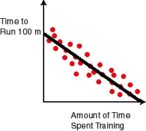

## Using Machine Learning to Predict Runner's 100 Meter Times

In our last [post](https://arogers1.github.io/Building-Skynet-Machine-Learning/) we talked about how machine learning is tightly related to pattern recognition, and how most patterns in the world don't have a mathematical function we can use to perfectly predict any data point in the pattern. If we did have such a pattern, machine learning wouldn't be necessary, because we could simply use the pattern's underlying function for prediction. We used this plot as an example of a real-world pattern that we can't perfectly predict with a mathematical function:


As we said before, the pattern shown here is clear: runners who spent more time training had faster 100 meter times in general. However, there isn't necessarily a cut and dry function that would generate all those exact points as a function of training time. Well, there actually are functions that could generate this *specific* set of points exactly, but if you added more examples of runners and their 100 meter times they almost certainly wouldn't predict all the new runners' times perfectly. In other words, there is no function that we can practically discover that would perfectly predict the set of all runners' 100 meter times compared to training time, even though there is a very obvious pattern of how 100 meter time is related to training time. So we know two things:

1. There is some *unknown* underlying function that defines how fast runners run 100 meters versus their time spent training, and
2. That function seems to be subject to random noise and is therefore likely to remain unknown, at least the exact function.

So we could define the function, f, for runners' 100 meter times as:

```
f(x) = t(x) + ε
```

Where x is the runner's time spent training, t is the unknown function that generates 100 meter times from x, and ε is the stochastic (a fancy word for random) factor that makes our plot look noisy.

So now you're probably thinking, "this is absolutely fascinating, except what does this have to do with machine learning, the supposed subject of this post?" Great question, reader. The answer is that in this chart and its corresponding function f(x) we have found a great candidate for using machine learning. Because we know some f(x) exists but we cannot find it through analytical methods due to the random noise (ε), the best we can do is approximate f, and that's where machine learning comes in. We can come up with hypothesis functions, h(x), that approximate f(x), and pick the h(x) that best approximates f.

That last sentence was loaded, of course. First, how do we define "best" when we say pick the h that "best" approximates f? Second, how do we even come up with the hypothesis functions at all? It turns out those two questions are closely related. We'll go into the answers in more detail in subsequent posts, but for now let's just focus on the runner example.

## Choosing Hypotheses and Measuring their "Goodness"

Let's imagine the simplest hypothesis function we could use to approximate our f: a line. Great, now we've answered out second question: we come up with our hypothesis functions by coming up with different lines and see how well they fit the data (seems arbitrary, right? We'll go into why it's a good choice and how to make good hypothesis choices later). But we still need to define what "best" means when it comes to choosing which line is best. It's not too hard think of a line that fits our data (approximates f) really well. It looks something like this:



We can see that the above line, or h(x), is probably our best approximation of f(x) if we're only using lines. But what does best mean, mathematically speaking? Well, think about the total distance of all points on our graph to our line - add up the distances from the line point by point. Let's call that our "error", meaning how badly we failed to exactly approximate f. If we were to move our line up or down, what would happen to our error? What if we changed the angle of our line, what would happen to the error then? With a little thought it's apparent that if we changed our line in any of those ways our error - the sum of all distances of points to the line - would increase.
