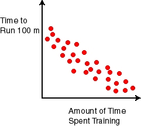

## Using Machine Learning to Predict Runner's 100 Meter Times

In our last [post](https://arogers1.github.io/Building-Skynet-Machine-Learning/) we talked about how machine learning is tightly related to pattern recognition, and how most patterns in the world don't have a mathematical function we can use to perfectly predict any data point in the pattern. If we did have such a pattern, machine learning wouldn't be necessary, because we could simply use the pattern's underlying function for prediction. We used this plot as an example of a real-world pattern that we can't perfectly predict with a mathematical function:



As we said before, the pattern shown here is clear: runners who spent more time training had faster 100 meter times in general. However, there isn't necessarily a cut and dry function that would generate all those exact points as a function of training time. Well, there actually are functions that could generate this *specific* set of points exactly, but if you added more examples of runners and their 100 meter times they almost certainly wouldn't predict all the new runners' times perfectly. In other words, there is no function that we can practically discover that would perfectly predict the set of all runners' 100 meter times compared to training time, even though there is a very obvious pattern of how 100 meter time is related to training time. So we know two things:

1. There is some *unknown* underlying function that defines how fast runners run 100 meters versus their time spent training, and
2. That function seems to be subject to random noise and is therefore likely to remain unknown, at least the exact function.

So we could define the function, f, for runners' 100 meter times as:

```
f(x) = t(x) + ε
```

Where x is the runner's time spent training, t is the unknown function that generates 100 meter times from x, and ε is the stochastic (a fancy word for random) factor that makes our plot look noisy.

So now you're probably thinking, "this is absolutely fascinating, except what does this have to do with machine learning, the supposed subject of this post?" Great question, reader. The answer is that in this chart and its corresponding function f(x) we have found a great candidate for using machine learning. What if we wanted to predict how fast a runner would run the 100 meter dash given the amount of time they spent training? Because we know some f(x) exists but we cannot find it through analytical methods due to the random noise (ε), the best we can do is approximate f(x) (the runner's 100 meter time), and that's where machine learning comes in. We can come up with hypothesis functions, h(x), that approximate f(x), and pick the h(x) that best approximates f.

That last sentence was loaded, of course. First, how do we define "best" when we say pick the h that "best" approximates f? Second, how do we even come up with the hypothesis functions at all? It turns out those two questions are closely related. We'll go into the answers in more detail in subsequent posts, but for now let's just focus on the runner example.

## Choosing Hypotheses and Measuring their "Goodness"

Let's imagine the simplest hypothesis function we could use to approximate our f: a line. Great, now we've answered out second question: we come up with our hypothesis functions by coming up with different lines and see how well they fit the data (seems arbitrary, right? We'll go into why it's a good choice and how to make good hypothesis choices later). But we still need to define what "best" means when it comes to choosing which line is best. It's not too hard think of a line that fits our data (approximates f) really well. It looks something like this:


We can see that the above line, or h(x), is probably our best approximation of f(x) if we're only using lines. But what does best mean, mathematically speaking? Well, think about the total distance of all points on our graph to our line - add up the distances from the line point by point. Let's call that our "error", meaning how badly we failed to exactly approximate f. If we were to move our line up or down, what would happen to our error? What if we changed the angle of our line, what would happen to the error then? With a little thought it's apparent that if we changed our line in any of those ways our error - the sum of all distances of points to the line - would increase. Therefore, we can define the "best" hypothesis as being the hypothesis that has the lowest *error*. In other words, in choosing our hypotheses, we want to *minimize* our error. This point is crucial, so let me reiterate. Choosing the best hypothesis requires:

1. Defining an error function, a measure of how badly our hypothesis fails to approximate the target function, and
2. Choosing the hypothesis that minimizes that error function.

These two steps are what constitute the *learning* in machine learning - the machine is learning a function that minimizes error in approximating a target function.

## More on Choosing Hypotheses - In-Sample vs. Out of Sample Error

Let's go back to the step we glossed over before: how do we come up with hypotheses? We seemingly arbitrarily decided that we were only going to consider lines as our hypothesis functions, and that's how we limited how to come up with hypotheses. There are obviously infinite types of functions we could have chosen to approximate the 100 meter times function: polynomial functions, logarithmic, combinations of boolean operators, etc. Infinity is an overwhelming amount, obviously. In reality, there are also infinite possible lines we could choose from, but by narrowing our choice to only lines we limit the scope of our approximation task significantly. 

However, let's think about our ultimate objective here: predicting runners' 100 meter times given their time spent training. Does limiting our hypotheses to only lines limit our ability to accurately predict 100 meter times? Look at the above chart with our best line approximation. Even our best hypothesis clearly has a lot of error in its predictions! If minimizing error is the name of the game, then we could certainly do much better with a more complex hypothesis function, like this one:


Our function passes through every point, and therefore our error is zero! We've acheived the perfect hypothesis, right? Well, let's think about it. What happens if you add another runner's 100 meter time given their time spent training? How likely is it that our squiggly, complex hypothesis will perfectly predict that new point? What if we add a hundred more points, or a thousand, or a million? What do you think the total error on all those new points will be? It's pretty obvious that our complicated hypothesis will fail miserably on the new points coming in. Compare that to the error of our best line hypothesis on all those new points: there would still be error, but that error would probably be about the same amount of error as its error on the existing points. We can deal with that.

This idea of our hypothesis' error on new, unknown points, indeed the set of all unknown points that could be generated by the underlying target function is called *out of sample error*. Our hypothesis' error on the points that we do know, those in the plot, is called *in-sample error*, referring to the fact that we're measuring error only on points in our known sample. Obviously, we can only measure in-sample error - it's not possible to know what our error will be on the (infinite) set of all points that can be generated by the target function that we haven't seen yet. To put that concretely, we don't know exactly how well our model predicts the 100 meter times of all runners in the world given their time spent training.

In our squiggly, complicated hypothesis, our in-sample error is zero - a perfect score! - but our out of sample error is likely to be abysmal. This is known as *overfitting*, where our machine learning model essentially just learned the random noise inherent in our specific sample of 100 meter times that isn't present in the set of all 100 meter times. Conversely, our line hypothesis had some error, but it likely will perform similarly well on 100 meter times it hasn't seen before. It's better to have some in-sample error but be confident that your out of sample error will be similar than to have little to no in-sample error but have your out of sample error be far worse, because we already know the answers to the points in our sample. What we really care about is predicting the points we haven't seen before.

A cautionary point that doesn't apply as much to our extremely simple dataset is that if we pick hypotheses that are too simple, we run the risk of *underfitting*, such that even though our in-sample error will be similar to our out of sample error, both are too high to be useful. We need to strike a balance between underfitting and overfitting.

We will go into this in far more detail in a subsequent post, but there is a general rule for picking our hypotheses to minimize both in-sample and out of sample error (and thereby avoid both underfitting and overfitting). More complex models reduce our in-sample error more effectively, but run more risk of overfitting. Less complex models won't overfit as often, but run the risk of underfitting our data. The goal is to find a level of complexity in your machine learning models that correctly balances under- and overfitting for your problem. There are several strategies for finding this balance, which we'll talk about in another post.

## Summary

This post has covered several topics fairly quickly, and there is far more depth to go into on each of these topics. However, we'll save the in-depth discussion for later posts. For now, let's wrap up this post by summarizing a few key points:

First, let's think about when machine learning is even applicable. What are the key attributes of our 100 meter time example that make it a viable problem to be solved by machine learning?

1. There is a pattern to be found.
2. That pattern can't be perfectly defined by a mathematical function that we can directly discover.
3. We have sample data to give us an idea of the underlying pattern function.

In cases where all three of these requirements are met, what must be done to apply machine learning?

1. Come up with a set of hypothesis functions to approximate the pattern's underlying function from our sample data.
2. Define an error function that determines how well a hypothesis fits our data.
3. Pick the hypothesis that minimizes that error function.

And finally, we touched on the idea of in-sample and out of sample error and under/overfitting.

1. More complex hypotheses will lower in-sample error, but run a higher risk of overfitting.
2. Less complex hypotheses are less likely to overfit, but may not reduce error enough to be useful and thereby underfit.
3. You need to strike a balance in the complexity of your hypotheses to minimize out of sample error, which is the only error that really matters for your predictions.

I'm going to run a third and final part of this post that gives an overview of the different use-cases for machine learning and introduces the topics we'll be covering in the rest of our "Building Skynet" series. Stay tuned!
