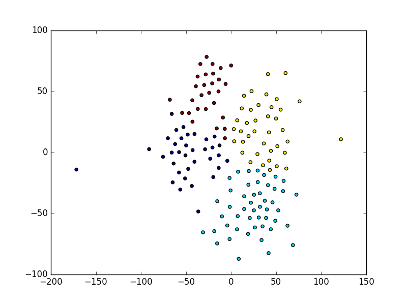

# Machine Learning Part 3

In the previous 2 parts of our 3 part machine learning post we talked informally about some machine learning theory - what machine learning is, its relationship to pattern recognition, when it can be used, etc. This post will cover the different types of machine learning and in what situations to use them. We'll be talking about supervised vs. unsupervised learning, which refer to whether or not you have any labels or "right answers" in your dataset, and regression vs. classification vs. ranking, which refer to what type of variable your machine learning model is trying to predict.

I realize this whole post has been descriptive rather than hands-on, and will continue to be so, but future posts will be very hands-on with working code examples and what-not - this post is meant to set the stage for really digging in to specific machine learning algorithms and techniques, so please bear with me :)

## Supervised vs. Unsupervised Learning

The difference between supervised and unsupervised learning is simple: in supervised learning problems you have correct answers, or *labels*, along with your input data. In unsupervised learning, you don't.

### Supervised Learning

Think back to your high school Biology class, sitting in the classroom with the teacher up at the board drilling into your head basic human anatomy. This is the femur, this is the tibia, this is the fibula (why did they have to make those names so similar?), and so on. She tells you there will be a quiz on the names of the leg bones the next day, so you create flash cards with pictures of leg bones on one side and their names on the other side. You study hard, at first getting the answers wrong when you review your flash cards but gradually getting better and better at identifying the correct names for the bones, and the next day you ace your quiz. You have just successfully performed *supervised learning*. You had input observations (the picture side of the flash cards) and along with them, you had the correct *labels* (the name side of the flash cards).

(image credit: http://facy.dvrlists.com/leg-bones-anatomy/)

Other examples of supervised learning include teaching a machine to recognize pictures of a cat vs. a dog. You feed the model lots of pictures of cats that are labelled "cat" and lots of pictures of dogs that are labelled "dog" so your model can learn the differences that make one picture a cat and another a dog. Or perhaps you want to predict housing prices in Seattle, so you gather lots of historical data on houses, including # of bedrooms and bathrooms, square footage, and so forth, and you also get their prices. You then feed your model all the data along with the correct answers so the model can learn the patterns in the input data that lead to correctly predicting the price. Our 100 meter time model from the previous parts of this post was another example of a supervised learning problem.

### Unsupervised Learning

Unsupervised learning problems are those in which you don't have any right answers to begin with, but you know (or suspect) that there are meaningful patterns in the data and want to find those patterns. *Clustering* is a very common type of unsupervised learning, in which you want to group your data into *clusters* according to which data points go well together (by some definition of "going well together"). For example, a company's marketing team may want to group their customers into different market segments based on demographics, habits, interests, and other information. Here's an example of a clustering algorithm being run on the famous Iris dataset, which has data on different types of flowers. Each color is a cluster, so points of the same color are in the same cluster:

As you might imagine, unsupervised learning can be much more difficult to get meaningful answers out of than supervised learning - after all, in unsupervised learning you don't have any right answers to go off of! However, unsupervised learning is extremely important for at least 2 reasons: 
1. humans, the best learners we know of, do much of their learning through unsupervised learning, and
2. labelled data is really hard to come by. We have petabytes of data being created every minute, but very little of it comes with a label.
Many of the world's machine learning experts consider unsupervised learning to be the most important field for machine learning research going forward if we want to create "intelligent" machines (you know, like Skynet :) ). Here's one example from Yann LeCun, the director of Facebook Artificial Intelligence Research (FAIR) and one of the world's leading experts on deep learning (the hottest topic in machine learning these days): [http://spectrum.ieee.org/automaton/robotics/artificial-intelligence/facebook-ai-director-yann-lecun-on-deep-learning#qaTopicFive](http://spectrum.ieee.org/automaton/robotics/artificial-intelligence/facebook-ai-director-yann-lecun-on-deep-learning#qaTopicFive)

### Weakly Supervised and Semi-Supervised Learning

There are some in-between types of learning that lie between purely supervised and purely unsupervised learning. *Weakly Supervised Learning* problems are those in which the labels are noisy are indirectly related to the answers you want to predict. *Semi-Supervised* problems are those in which you only have a small amount of labelled data, and the rest is unlabelled. These aren't as common as supervised and unsupervised learning, but they are important due to the fact that, as we stated above, labelled datasets are hard to come by, and any sort of labels can help.

### Reinforcement Learning

Another type of learning that isn't quite supervised or unsupervised learning but somewhere in-between is reinforcement learning, which involves learning patterns by trying actions and seeing what kind of positive or negative consequence ensues. Humans do a lot of their learning this way, like learning to ride a bike: you try doing it one way then fall down and get hurt, so you realize you obviously need to change the way you're doing it because that hurt. Or 

We'll talk more about reinforcement learning in another post, but here's a really cool gif of a RL algorithm having learned to play Pong better than the AI player by playing thousands of games knowing nothing other than the raw pixels and whether it won or lost (so it doesn't know any of the rules of Pong or what the ball or paddle is or anything):

<iframe width="420" height="315" src="https://www.youtube.com/embed/YOW8m2YGtRg" frameborder="0" allowfullscreen></iframe>
